# CareerLuhh — Full System Planning Document v2
> "Career First, Everything Else Later"
> Talentbank First Cohort Tech Hackathon 2026

---

## 📋 Table of Contents
1. [Project Overview](#1-project-overview)
2. [Tech Stack](#2-tech-stack)
3. [User Roles & Auth](#3-user-roles--auth)
4. [Database Schema](#4-database-schema)
5. [Agent System](#5-agent-system)
6. [Portal Features](#6-portal-features)
7. [API Routes](#7-api-routes)
8. [UI/UX — Design System](#8-uiux--design-system)
9. [Architecture Diagram](#9-architecture-diagram)
10. [SDG Alignment](#10-sdg-alignment)
11. [Build Phases](#11-build-phases)
12. [Project Structure](#12-project-structure)

---

## 0. Mandatory Criteria Checklist (Talentbank Career OS)

### Step 1 — Core Job Platform Requirements
| Requirement | Status | Implementation |
|---|---|---|
| Sign up & register | ✅ | `/register` — 3 roles (student, candidate, employer), mock auth |
| Profile & resume builder | ✅ | Onboarding wizard + Portfolio + ResumeOCRAgent parses PDF |
| Job listings | ✅ | `/candidate/jobs` — 16 listings, search, filters |
| Job applications | ✅ | Apply modal → localStorage → `/candidate/applications` tracking |
| Job matching | ✅ | JobMatchAgent — trajectory-based AI matching with explanations |
| Keyword & job search | ✅ | Search bar + category + work mode filters on job board |
| Candidate dashboard | ✅ | `/candidate/dashboard` — readiness, coach, salary alert, job digest |
| Employer dashboard | ✅ | `/employer/dashboard` — talent radar, retention alerts, onboarding |

### Step 2 — Modules Covered
| Module | Audience | Implementation |
|---|---|---|
| Career Path Navigator | Candidate | PathfinderAgent → `/student/roadmap` + `/candidate/next-move` |
| Living Portfolio | Candidate | `/student/portfolio` + `/candidate/portfolio` — tech stack, cert ID, GitHub URL |
| AI Career Coach | Candidate | CoachAgent — urgency-aware advice on dashboard |
| Fair Pay Engine | Candidate | PayBenchmarkAgent → `/candidate/salary` — benchmark + negotiation script |
| Smart Talent Matching | Employer | TrajectoryMatchAgent → `/employer/search` + AI Matched tab on job board |
| Talent Retention Signals | Employer | RetentionSignalAgent → `/employer/dashboard` alerts |
| Talent Re-Engagement | Employer | ReEngagementAgent → `/employer/re-engage` warmlist |
| Onboarding Success Predictor | Employer | OnboardingAgent → `/employer/onboarding` new hire tracker |
| Workforce Resilience Planner | Employer | WorkforceAgent → `/employer/workforce` 30-year plan |
| Adaptive Readiness Profile | University/Student | ReadinessAgent → student dashboard score |
| Live Internship Marketplace | University/Student | InternMatchAgent → `/student/internships` matched listings |
| Lifelong Outcome Loop | University/Student | Student → Candidate transfer at `/student/graduate` tracks full arc |

### Scoring Alignment
| Criterion | Weight | How We Address It |
|---|---|---|
| Product & UX Thinking | 30% | 3 portals × full user journey, Bauhaus design system, real user tasks completed |
| System Design & Integration | 25% | Shared Career Profile, 16 agents pipeline, multi-role auth, modular architecture |
| Completeness | 20% | All 8 basics implemented, clickable prototype, deployable to Vercel |
| AI Craft | 15% | 16 specialised agents, trajectory-based (not keyword) matching, RAG knowledge base in Agent Console |
| Code Quality | 10% | TypeScript strict, Tailwind design tokens, no magic numbers, zero TS errors |

---

## 1. Project Overview

**CareerLuhh** is Asia's Career Co-Pilot — a multi-agent AI system that guides users from student life through active employment. Unlike traditional job portals that match by keyword, CareerLuhh matches by **trajectory** — where you're heading, not just where you've been.

### Three Portals, One Shared Career Profile
- 🎓 **Student Portal** — Discover paths, build portfolio, find internships
- 💼 **Candidate Portal** — Job hunt smarter, benchmark salary, plan next move
- 🏢 **Employer Portal** — Find talent by trajectory, retain and re-engage

### What Makes It Different
- **16 Specialised AI Agents** — each does one job, minimal hallucination
- **Living Career Profile** — evolves from student to senior, never starts from scratch
- **Malaysia-First** — MUET, TVET, gig economy, rural-to-urban, local job boards integrated
- **SDG-Aligned** — SDG 4, 8, 10, 17

---

## 2. Tech Stack

### Frontend
```
Framework     : Next.js 14 (App Router)
Styling       : Tailwind CSS
UI Components : shadcn/ui
Charts/Viz    : Recharts + custom React SVG tree (roadmap.sh-style)
Animation     : Framer Motion (minimal, mechanical feel)
Icons         : Lucide React
Font          : Outfit (Google Fonts) — geometric sans, Bauhaus-aligned
```

### Backend
```
Runtime       : Next.js API Routes (serverless)
Database      : Neon (PostgreSQL, serverless)
Auth          : NextAuth.js v5 (credentials + Google OAuth)
File Storage  : Uploadthing (resume PDF uploads)
ORM           : Prisma
```

### AI Layer
```
LLM           : Google Gemini 2.0 Flash (FREE tier — 15 RPM, 1,500 req/day)
Package       : @google/generative-ai
API Key       : Free from https://aistudio.google.com
Why Gemini    : Free, fast, accurate JSON output, 1M token context window

Agent Orchestration : Custom sequential + parallel pipeline in /lib/agents/
Resume OCR          : pdf-parse + Gemini vision
Job Scraping        : Maukerja API, Jobstreet API (Stage 2 only)
```

### DevOps
```
Hosting       : Vercel
Repo          : GitHub
Env Secrets   : Vercel Environment Variables / .env.local
```

### Stage 1 Note — DUMMY DATA ONLY
```
⚠️ For Stage 1 prototype:
- NO real database calls
- ALL agent responses = hardcoded mock JSON
- Auth = mock login (hardcoded test accounts per role)
- Job listings = static dummy array
- Roadmap tree = pre-built static data

Real Neon DB + real Gemini agents = Stage 2 only
```

---

## 3. User Roles & Auth

### 3.1 Sign Up Flow

```
Landing Page
    ↓
"Get Started" CTA
    ↓
Choose Role:
  [ 🎓 I'm a Student ]  [ 💼 I'm a Job Seeker ]  [ 🏢 I'm an Employer ]
    ↓
Fill registration form (role-specific fields)
    ↓
Email verification
    ↓
Onboarding wizard (role-specific, 3-step max)
    ↓
Dashboard
```

### 3.2 Role-Specific Registration Fields

**Student**
- Full name, email, password
- University name
- Programme (Diploma / Degree / Foundation)
- Field of study
- Current semester / year
- Expected graduation date

**Candidate (Job Seeker)**
- Full name, email, password
- Employment status (employed / unemployed / freelance / gig)
- Years of experience
- Current/last role
- Upload resume (PDF) → triggers The Clerk

**Employer**
- Company name, email, password
- Industry
- Company size
- Hiring contact name & role

### 3.3 Stage 1 Mock Accounts
```javascript
// Hardcode these for prototype demo
const MOCK_USERS = [
  { email: "student@demo.com", password: "demo123", role: "student" },
  { email: "candidate@demo.com", password: "demo123", role: "candidate" },
  { email: "employer@demo.com", password: "demo123", role: "employer" }
]
```

### 3.4 Auth Rules (Stage 2)
```
Public routes     : /, /about, /login, /register
Protected routes  : /student/*, /candidate/*, /employer/*
Role guard        : Middleware checks session.user.role
Session           : NextAuth JWT session
```

---

## 4. Database Schema

> ⚠️ Stage 1: Skip DB entirely. Use mock data.
> Stage 2: Set up Neon + run Prisma migrations.

### Prisma Schema (for Stage 2)

```prisma
// schema.prisma

generator client {
  provider = "prisma-client-js"
}

datasource db {
  provider = "postgresql"
  url      = env("DATABASE_URL") // Neon connection string
}

enum Role {
  student
  candidate
  employer
}

enum EmploymentStatus {
  employed
  unemployed
  freelance
  gig
}

model User {
  id            String   @id @default(cuid())
  email         String   @unique
  password      String
  role          Role
  createdAt     DateTime @default(now())

  studentProfile    StudentProfile?
  candidateProfile  CandidateProfile?
  employerProfile   EmployerProfile?
  careerProfile     CareerProfile?
  agentLogs         AgentLog[]
}

model CareerProfile {
  id             String   @id @default(cuid())
  userId         String   @unique
  user           User     @relation(fields: [userId], references: [id])
  displayName    String?
  headline       String?
  location       String?
  readinessScore Int      @default(0)
  updatedAt      DateTime @updatedAt

  portfolioItems PortfolioItem[]
  careerPaths    CareerPath[]
  jobMatches     JobMatch[]
}

model StudentProfile {
  id             String    @id @default(cuid())
  userId         String    @unique
  user           User      @relation(fields: [userId], references: [id])
  university     String?
  programme      String?
  field          String?
  semester       Int?
  cgpa           Float?
  graduationDate DateTime?
  interests      String[]
  graduatedAt    DateTime? // set when student transfers to candidate

  academicResults AcademicResult[]
  semesterRecords SemesterRecord[]
}

model AcademicResult {
  id        String         @id @default(cuid())
  studentId String
  student   StudentProfile @relation(fields: [studentId], references: [id])
  semester  Int
  year      Int
  gpa       Float
  subjects  Json
}

model CandidateProfile {
  id               String           @id @default(cuid())
  userId           String           @unique
  user             User             @relation(fields: [userId], references: [id])
  employmentStatus EmploymentStatus @default(unemployed)
  currentRole      String?
  yearsExp         Int?
  skills           String[]
  resumeUrl        String?
  parsedResume     Json?
}

model EmployerProfile {
  id          String  @id @default(cuid())
  userId      String  @unique
  user        User    @relation(fields: [userId], references: [id])
  companyName String
  industry    String?
  size        String?

  internshipListings InternshipListing[]
  talentShortlist    TalentShortlist[]
}

model PortfolioItem {
  id            String        @id @default(cuid())
  careerProfile CareerProfile @relation(fields: [profileId], references: [id])
  profileId     String
  type          String        // project | github | cert | competition
  title         String
  description   String?
  url           String?       // project URL, GitHub URL, cert verify link
  techStack     String[]      // replaces skillsUsed — clearer naming
  dateDisplay   String?       // display string e.g. "Mar 2026"
  dateEnd       String?       // e.g. "Jun 2026" or "Ongoing"
  certId        String?       // optional cert ID, only for type=cert
  aiSummary     String?
}

model TranscriptSubject {
  id             String   @id @default(cuid())
  semesterRecord SemesterRecord @relation(fields: [semesterId], references: [id])
  semesterId     String
  code           String
  name           String
  creditHours    Int
  grade          String   // A, A-, B+, B, B-, C+, C, C-, D, E
  gradePoint     Float
}

model SemesterRecord {
  id        String              @id @default(cuid())
  studentId String
  student   StudentProfile      @relation(fields: [studentId], references: [id])
  semester  Int
  year      String              // e.g. "2024/25"
  gpa       Float
  subjects  TranscriptSubject[]
}

model CareerPath {
  id            String        @id @default(cuid())
  careerProfile CareerProfile @relation(fields: [profileId], references: [id])
  profileId     String
  generatedAt   DateTime      @default(now())
  paths         Json
}

model AgentLog {
  id          String   @id @default(cuid())
  userId      String
  user        User     @relation(fields: [userId], references: [id])
  agentCode   String
  input       Json
  output      Json
  triggeredAt DateTime @default(now())
}

model JobMatch {
  id            String        @id @default(cuid())
  careerProfile CareerProfile @relation(fields: [profileId], references: [id])
  profileId     String
  jobTitle      String
  company       String
  source        String
  url           String?
  matchScore    Int
  matchReason   String?
  status        String        @default("new")
  fetchedAt     DateTime      @default(now())
}

model InternshipListing {
  id             String          @id @default(cuid())
  employerId     String
  employer       EmployerProfile @relation(fields: [employerId], references: [id])
  title          String
  description    String?
  skillsNeeded   String[]
  location       String?
  mode           String
  durationMonths Int?
  allowance      Float?
  postedAt       DateTime        @default(now())
  isActive       Boolean         @default(true)

  applications InternshipApplication[]
}

model InternshipApplication {
  id        String            @id @default(cuid())
  studentId String
  listingId String
  listing   InternshipListing @relation(fields: [listingId], references: [id])
  status    String            @default("applied")
  matchScore Int?
  appliedAt DateTime          @default(now())
}

model TalentShortlist {
  id         String          @id @default(cuid())
  employerId String
  employer   EmployerProfile @relation(fields: [employerId], references: [id])
  profileId  String
  status     String          @default("watching")
  notes      String?
  addedAt    DateTime        @default(now())
}
```

---

## 5. Agent System

### Philosophy
- Each agent does **one job only**
- All agents read/write to the **shared Career Profile**
- Every agent is an API route in `/app/api/agents/`
- Gemini 2.0 Flash handles all LLM calls
- Stage 1: return mock JSON, skip actual Gemini call
- Every agent call logged in `agent_logs`

### Gemini Client Setup

```typescript
// lib/gemini.ts
import { GoogleGenerativeAI } from "@google/generative-ai"

const genAI = new GoogleGenerativeAI(process.env.GEMINI_API_KEY!)

export const gemini = genAI.getGenerativeModel({
  model: "gemini-2.0-flash",
  generationConfig: {
    responseMimeType: "application/json", // Forces JSON output
  },
})
```

### Agent Base Pattern

```typescript
// lib/agents/_base.ts
export async function runAgent(
  systemPrompt: string,
  userInput: object,
  mockResponse: object, // Stage 1: return this instead
  useMock = true        // Stage 1: true. Stage 2: false
) {
  if (useMock) return mockResponse

  const prompt = `${systemPrompt}\n\nInput:\n${JSON.stringify(userInput, null, 2)}`
  const result = await gemini.generateContent(prompt)
  const text = result.response.text()
  return JSON.parse(text)
}
```

---

### 5.1 Student Agents

#### `PathfinderAgent` — The Navigator
**Trigger:** Student completes onboarding OR manually requests new path
**Input:** Programme, field, CGPA, transcript (subject grades per semester), interests, location
**Notes:** Transcript adds academic direction signals — e.g. consistently high maths grades suggest data/AI paths; strong HCI grades suggest UX paths.
**Output:** Career path tree (nodes + edges for React SVG render)

**System Prompt:**
```
You are The Navigator (PathfinderAgent) inside CareerLuhh.
Your ONLY job is to generate realistic career path trees for students.

Rules:
- Generate 3-4 distinct career paths based on the student's background
- Paths must be realistic for Malaysian market, not aspirational fantasy
- Include timeline, salary range (in RM), skill gaps, and next actions
- Consider student's location — if rural, suggest remote-friendly paths too
- Output ONLY valid JSON. No extra text. No markdown.
- Never hallucinate — use Malaysian market salary ranges
```

**Mock Output (Stage 1):**
```json
{
  "paths": [
    {
      "id": "path_1",
      "title": "Frontend Developer",
      "color": "#1040C0",
      "timeline": "12-18 months",
      "salaryRange": "RM3,000 - RM5,500",
      "matchScore": 87,
      "nodes": [
        { "id": "n1", "label": "Complete Degree", "type": "milestone", "x": 0, "y": 0 },
        { "id": "n2", "label": "Learn React + Next.js", "type": "skill", "x": 1, "y": 0 },
        { "id": "n3", "label": "Build 2 Portfolio Projects", "type": "action", "x": 2, "y": 0 },
        { "id": "n4", "label": "Junior Frontend Dev", "type": "role", "x": 3, "y": 0 }
      ],
      "edges": [
        { "from": "n1", "to": "n2" },
        { "from": "n2", "to": "n3" },
        { "from": "n3", "to": "n4" }
      ]
    },
    {
      "id": "path_2",
      "title": "UI/UX Designer",
      "color": "#D02020",
      "timeline": "8-12 months",
      "salaryRange": "RM2,800 - RM5,000",
      "matchScore": 74,
      "nodes": [
        { "id": "n1", "label": "Complete Degree", "type": "milestone", "x": 0, "y": 0 },
        { "id": "n2", "label": "Learn Figma + Design Systems", "type": "skill", "x": 1, "y": 0 },
        { "id": "n3", "label": "Build Case Studies", "type": "action", "x": 2, "y": 0 },
        { "id": "n4", "label": "Junior UI/UX Designer", "type": "role", "x": 3, "y": 0 }
      ],
      "edges": [
        { "from": "n1", "to": "n2" },
        { "from": "n2", "to": "n3" },
        { "from": "n3", "to": "n4" }
      ]
    },
    {
      "id": "path_3",
      "title": "Data Analyst",
      "color": "#F0C020",
      "timeline": "18-24 months",
      "salaryRange": "RM3,500 - RM6,500",
      "matchScore": 61,
      "nodes": [
        { "id": "n1", "label": "Complete Degree", "type": "milestone", "x": 0, "y": 0 },
        { "id": "n2", "label": "Learn Python + SQL", "type": "skill", "x": 1, "y": 0 },
        { "id": "n3", "label": "Kaggle + Personal Projects", "type": "action", "x": 2, "y": 0 },
        { "id": "n4", "label": "Junior Data Analyst", "type": "role", "x": 3, "y": 0 }
      ],
      "edges": [
        { "from": "n1", "to": "n2" },
        { "from": "n2", "to": "n3" },
        { "from": "n3", "to": "n4" }
      ]
    }
  ]
}
```

---

#### `ReadinessAgent` — The Auditor
**Trigger:** After PathfinderAgent runs OR student updates portfolio OR adds transcript records
**System Prompt:**
```
You are The Auditor (ReadinessAgent) inside CareerLuhh.
Your ONLY job is to assess how hireable a student is RIGHT NOW.

Score breakdown:
  academic results (30%) ← uses CGPA + per-subject grades from transcript
  skills (30%)           ← extracted from portfolio techStack fields
  portfolio (25%)        ← project count, GitHub activity, cert IDs
  soft indicators (15%)  ← MUET band, competition entries, location flexibility

Be honest — do not inflate scores.
Output ONLY valid JSON: { score, grade, gaps: [], strengths: [], nextActions: [] }
```

**Mock Output:**
```json
{
  "score": 62,
  "grade": "B",
  "gaps": ["No portfolio projects yet", "Missing internship experience", "LinkedIn profile incomplete"],
  "strengths": ["CGPA above 3.0", "Active GitHub account", "Strong academic results in core subjects"],
  "nextActions": ["Build one full-stack project this month", "Apply for internship by next semester", "Complete LinkedIn profile today"]
}
```

---

#### `InternMatchAgent` — The Recruiter
**Mock Output:**
```json
[
  {
    "id": "int_1",
    "company": "Maybank",
    "title": "IT Internship — Frontend Track",
    "mode": "hybrid",
    "location": "Kuala Lumpur",
    "allowance": 800,
    "matchScore": 91,
    "matchReason": "Your React interest + CGPA 3.2 aligns with their junior dev intern profile",
    "absorptionRate": "High — 70% converted to full-time last year",
    "duration": 6
  },
  {
    "id": "int_2",
    "company": "Shopee Malaysia",
    "title": "Product Design Intern",
    "mode": "onsite",
    "location": "Kuala Lumpur",
    "allowance": 1200,
    "matchScore": 78,
    "matchReason": "UI/UX interest shown in your profile matches product design track",
    "absorptionRate": "Medium — active hiring from intern pool",
    "duration": 4
  }
]
```

---

#### `SkorAlignAgent` — The Translator
**Mock Output:**
```json
{
  "localCert": "MUET Band 4",
  "globalEquivalent": "CEFR B2 (Upper Intermediate)",
  "cefrLevel": "B2",
  "employerDescription": "Demonstrates solid working proficiency in English — able to handle professional communication, presentations, and written reports independently."
}
```

---

#### `LokalRouteAgent` — The Planner
**System Prompt:**
```
You are The Planner (LokalRouteAgent) inside CareerLuhh.
Your ONLY job is to help users make location-vs-salary trade-off decisions.

Malaysian cost of living estimates (monthly):
- KL: ~RM1,500-2,750 total
- Penang: ~RM1,200-2,150 total
- JB: ~RM1,050-1,900 total
- Tier 2 cities (Alor Setar, Kota Bharu, Kuantan): ~RM700-1,200 total

Always calculate: Gross Salary - Cost of Living = Net Disposable Income
Compare at least 2 scenarios. Flag remote/hybrid options.
Output ONLY valid JSON.
```

**Mock Output:**
```json
{
  "scenarios": [
    {
      "city": "Kuala Lumpur",
      "grossSalary": 3500,
      "costOfLiving": 2100,
      "netDisposable": 1400,
      "mode": "onsite",
      "verdict": "Moderate savings — tight budget in first year"
    },
    {
      "city": "Alor Setar (Remote)",
      "grossSalary": 3000,
      "costOfLiving": 900,
      "netDisposable": 2100,
      "mode": "remote",
      "verdict": "Better net savings — recommended if remote role available"
    }
  ],
  "recommendation": "The Remote job in Alor Setar saves RM700/month more than KL despite RM500 lower salary. Prioritise remote-first roles.",
  "remoteJobsAvailable": true
}
```

---

#### `CoachAgent` — The Advisor (Student Mode)
**Mock Output:**
```json
{
  "message": "Your graduation is 4 months away and your readiness score is 62. You need at least one deployed project before you start applying. Start this weekend — even a simple one counts.",
  "urgency": "medium",
  "actionLabel": "See what to build",
  "actionUrl": "/student/roadmap"
}
```

---

### 5.2 Candidate Agents

#### `ResumeOCRAgent` — The Clerk
**System Prompt:**
```
You are The Clerk (ResumeOCRAgent) inside CareerLuhh.
Your ONLY job is to parse a resume PDF and extract structured data.

Extract: personal info, work experience, education, skills, certifications, projects.
Do not invent or infer data not in the resume.
If field is missing, return null.
Output ONLY valid JSON.
```

**Mock Output:**
```json
{
  "name": "Ahmad Faris bin Azman",
  "email": "faris@email.com",
  "phone": "012-3456789",
  "location": "Shah Alam, Selangor",
  "currentRole": "Junior Software Engineer",
  "yearsExp": 2,
  "skills": ["JavaScript", "React", "Node.js", "MySQL", "Git"],
  "education": [
    {
      "institution": "UiTM Shah Alam",
      "qualification": "Bachelor of Computer Science (Hons)",
      "year": 2022,
      "cgpa": 3.45
    }
  ],
  "experience": [
    {
      "company": "TechStartup Sdn Bhd",
      "role": "Junior Software Engineer",
      "duration": "Jan 2023 - Present",
      "responsibilities": ["Built React dashboards", "Maintained REST APIs", "Participated in sprint planning"]
    }
  ],
  "certifications": ["AWS Cloud Practitioner (2023)"],
  "projects": ["E-commerce platform (freelance)", "Personal finance tracker (side project)"]
}
```

---

#### `NextMoveAgent` — The Navigator (Candidate Mode)
**Mock Output:**
```json
[
  {
    "type": "safe",
    "label": "Safe Move",
    "role": "Mid-level Frontend Developer",
    "timeline": "3-6 months",
    "salaryRange": "RM5,500 - RM7,500",
    "upskilling": ["TypeScript (2 months)", "Testing with Jest"],
    "reason": "Natural progression from current role — low risk, steady salary jump"
  },
  {
    "type": "growth",
    "label": "Growth Move",
    "role": "Full-Stack Developer (Next.js + Node)",
    "timeline": "6-9 months",
    "salaryRange": "RM6,500 - RM9,000",
    "upskilling": ["Next.js App Router", "PostgreSQL", "Docker basics"],
    "reason": "Expands your stack — opens MNC and product company doors"
  },
  {
    "type": "bold",
    "label": "Bold Pivot",
    "role": "Product Manager (Technical Track)",
    "timeline": "12-18 months",
    "salaryRange": "RM8,000 - RM14,000",
    "upskilling": ["Product Management fundamentals", "Analytics (GA4, Mixpanel)", "Stakeholder communication"],
    "reason": "Your engineering background is a rare PM asset — high ceiling but needs intentional transition"
  }
]
```

---

#### `PayBenchmarkAgent` — The Analyst
**Mock Output:**
```json
{
  "verdict": "Underpaid",
  "currentSalary": 4200,
  "benchmarkMin": 5000,
  "benchmarkMax": 7500,
  "gap": 800,
  "percentilePosition": "Bottom 25% for your role and experience",
  "negotiationTip": "Open with: 'Based on my 2 years of delivered projects and current market rates for React developers in KL, I'd like to discuss adjusting my compensation to RM5,500.'",
  "bestTiming": "Annual review coming in 2 months — prepare now. Or use a competing offer as leverage."
}
```

---

#### `JobMatchAgent` — The Broker
**Mock Output:**
```json
[
  {
    "id": "job_1",
    "title": "Frontend Developer (React)",
    "company": "Grab Malaysia",
    "source": "linkedin",
    "url": "https://linkedin.com/jobs/...",
    "matchScore": 94,
    "matchReason": "Your React + Node.js background directly fits their consumer web team. They value trajectory — your side projects signal growth mindset.",
    "salaryRange": "RM6,000 - RM8,500",
    "mode": "hybrid",
    "location": "Kuala Lumpur",
    "stretchFlag": false
  },
  {
    "id": "job_2",
    "title": "Software Engineer (Full-Stack)",
    "company": "Shopee",
    "source": "jobstreet",
    "url": "https://jobstreet.com.my/...",
    "matchScore": 81,
    "matchReason": "Slightly above current level — worth applying. Your AWS cert fills their infra gap.",
    "salaryRange": "RM7,000 - RM10,000",
    "mode": "onsite",
    "location": "Kuala Lumpur",
    "stretchFlag": true
  }
]
```

---

#### `GigBridgeAgent` — The Converter
**Mock Output:**
```json
[
  {
    "original": "Grab food delivery driver, 2 years, 3,200 deliveries, 4.91 rating",
    "converted": "Logistics operations specialist with 2 years of high-volume, time-critical delivery management. Maintained 98.2% on-time performance across 3,200+ orders with a 4.91/5 customer satisfaction rating. Demonstrated expertise in route optimisation, real-time problem solving, and professional client interaction.",
    "skillsExtracted": ["Time management", "Route optimisation", "Customer service", "Reliability under pressure", "Operational consistency"]
  }
]
```

---

#### `CoachAgent` — The Advisor (Candidate Mode)
**Mock Output:**
```json
{
  "message": "You've been at RM4,200 for 18 months. Market rate for your stack is RM5,500 minimum. Annual review is in 6 weeks — that's your window. Want me to help you prep the conversation?",
  "urgency": "high",
  "actionLabel": "See salary benchmark",
  "actionUrl": "/candidate/salary"
}
```

---

### 5.3 Employer Agents

#### `TrajectoryMatchAgent` — The Headhunter
**Mock Output:**
```json
[
  {
    "candidateId": "cand_001",
    "name": "Nurul Ain bt Rosli",
    "currentRole": "Junior Developer",
    "university": "UTM",
    "trajectoryScore": 89,
    "trajectorySummary": "Has basic React but actively learning Next.js and TypeScript based on recent portfolio commits. Trajectory aligns with your modernisation project Q3.",
    "readinessScore": 74,
    "matchReason": "Growth curve matches your mid-level opening in 3 months — hire now, ramp fast."
  }
]
```

---

#### `TalentRadarAgent` — The Scout
**Mock Output:**
```json
{
  "weeklyDigest": [
    {
      "candidateId": "cand_002",
      "name": "Haziq bin Hamdan",
      "highlight": "TVET grad, self-taught React in 6 months, 3 deployed projects. Matches your last 2 successful junior hires.",
      "whyFlag": "Non-traditional background but strong trajectory — often missed by keyword filters"
    }
  ]
}
```

---

#### `RetentionSignalAgent` — The Watcher
**Mock Output:**
```json
{
  "employeeId": "emp_003",
  "name": "Siti Hajar bt Kamaruddin",
  "riskLevel": "medium",
  "signals": ["Updated LinkedIn profile 3 days ago", "Added new skills (Docker, Kubernetes) not relevant to current role"],
  "recommendedAction": "Have a career conversation this week. Ask where she sees herself in 12 months. She may be looking for a path to senior level — do you have that for her?"
}
```

---

#### `ReEngagementAgent` — The Diplomat
**Mock Output:**
```json
{
  "subjectLine": "Still thinking about you — new opening at [Company]",
  "messageDraft": "Hi [Name], it's been about 18 months since we last spoke. I remember you were focused on building your data engineering skills at the time — looks like you've made great progress. We have a Senior Data Engineer role opening next month that I think is worth a conversation. Would a quick 20-minute call work for you?",
  "sendTiming": "Tuesday or Wednesday morning, 9-11am — highest reply rate",
  "notes": "Candidate was rejected due to budget constraint, not fit. High priority re-engage."
}
```

---

#### `OnboardingAgent` — The Buddy
**Mock Output:**
```json
{
  "newHireId": "hire_004",
  "name": "Irfan Danial bin Azmi",
  "checkInDay": 30,
  "riskScore": 42,
  "flags": ["Has not engaged in team Slack channels", "Submitted first PR 3 weeks late"],
  "managerAction": "Check in today — not performance review, just a genuine catch-up.",
  "conversationStarter": "Hey Irfan, just wanted to see how you're settling in. What's been the most surprising thing about the role so far?"
}
```

---

#### `WorkforceAgent` — The Strategist
**Mock Output:**
```json
{
  "summary": "Your current tech team of 12 has 3 roles at high automation risk in 18 months. Recommend upskilling budget allocation now rather than new hires.",
  "quarterlyPlan": [
    { "quarter": "Q3 2026", "action": "Upskill 2 junior devs to full-stack", "cost": "RM4,000 training" },
    { "quarter": "Q4 2026", "action": "Hire 1 senior AI engineer", "cost": "RM12,000/month" }
  ],
  "riskRoles": [
    { "role": "Manual QA Tester", "automationRisk": "High", "timeline": "12-18 months" },
    { "role": "Data Entry Specialist", "automationRisk": "Very High", "timeline": "6-12 months" }
  ],
  "recommendations": ["Invest in AI tooling training", "Prioritise remote hiring to access wider talent pool", "Build internship pipeline from UTM and UiTM"]
}
```

---

## 6. Portal Features

### 6.1 Student Portal
```
/student/dashboard          → Readiness score, coach alert, quick actions, "Got a Job?" CTA
/student/roadmap            → Interactive career path tree (custom React SVG)
/student/internships        → The Recruiter — matched internships
/student/portfolio          → Living portfolio — add projects, GitHub, certs
/student/transcript         → Mini transcript — subjects + grades + GPA trend per semester
/student/qualifications     → The Translator — MUET, SKM, STPM
/student/lokal              → The Planner — city cost comparison tool
/student/agents             → Agent Console — watch pipeline run live
/student/onboarding         → 3-step onboarding wizard
/student/graduate           → Profile Graduation wizard (student → candidate transfer)
```

#### Portfolio Item Fields (updated)
```
type        : project | github | cert | competition
title       : string
description : string
techStack   : string[]          ← comma-separated on input, stored as array
date        : string            ← display format "Mar 2026" or "Active"
dateEnd     : string (optional) ← "Jun 2026" or "Ongoing"
url         : string (optional) ← GitHub URL, project URL, cert verify link
certId      : string (optional) ← only for cert type, e.g. "AWS-CLF-2026-123456"
aiSummary   : string            ← The Auditor writes this in Stage 2
```

**GitHub API note (Stage 2):** When type = `github` and URL is provided, auto-fetch via:
`GET https://api.github.com/users/{username}/repos` → returns repo count, languages, stars, last push.
No auth needed for public repos (60 requests/hour unauthenticated, 5000 with token).

#### Mini Transcript (`/student/transcript`)
```
Per semester:
  - Semester number + academic year
  - Subjects: code, name, credit hours, grade (A/A-/B+/B/B-/C+/C/C-/D/E), grade point
  - Auto-calculated GPA per semester
  - CGPA recalculated across all semesters
  - GPA trend bar chart (visual)

Malaysian grading scale used:
  A = 4.0  |  A- = 3.7  |  B+ = 3.3  |  B = 3.0  |  B- = 2.7
  C+ = 2.3 |  C = 2.0   |  C- = 1.7  |  D = 1.0   |  E = 0.0

Feeds into:
  - PathfinderAgent → academic direction analysis (strong in maths? → data paths)
  - ReadinessAgent  → academic score component (30% of readiness)
  - SkorAlignAgent  → CGPA ↔ global grading equivalence
```

### 6.2 Candidate Portal
```
/candidate/dashboard        → Coach alerts, job digest, readiness
/candidate/jobs             → Job Board — browse all 16+ listings + AI matched tab + search/filter + Apply
/candidate/applications     → My Applications — status tracking (applied → interview → offer)
/candidate/next-move        → The Navigator — 3 path options
/candidate/salary           → The Analyst — benchmark + negotiation
/candidate/portfolio        → Living portfolio
/candidate/gig              → The Converter — gig → professional credentials
/candidate/lokal            → The Planner
/candidate/agents           → Agent Console
/candidate/onboarding       → Upload resume → The Clerk parses it
```

#### Job Board Features
```
Browse All Jobs tab:
  - 16 curated job listings across Technology, Design, Data, Product, Finance, Marketing
  - Keyword search (title, company, skill)
  - Filter by category + work mode (remote/hybrid/onsite)
  - Expandable job cards with requirements + skills
  - Apply button → modal (name, email, cover note)
  - Applied state persisted in localStorage

AI Matched tab:
  - Jobs pre-scored by JobMatchAgent
  - Explains WHY each job fits (trajectory-based reasoning)
  - Stretch flags for growth opportunities

Application Status tracking:
  applied → reviewing → shortlisted → interview → offer / rejected
  Visual timeline per application card
```

### 6.3 Employer Portal
```
/employer/dashboard         → Talent radar digest, retention alerts
/employer/jobs              → Post Jobs — post full-time listings + manage applicants
/employer/search            → The Headhunter — search by trajectory
/employer/saved             → Shortlisted candidates
/employer/internships       → Post + manage internship listings
/employer/re-engage         → The Diplomat — warmlist
/employer/onboarding        → The Buddy — new hire tracker
/employer/workforce         → The Strategist — workforce plan
/employer/agents            → Agent Console
```

#### Employer Job Posting Features
```
Post a Job form:
  title, category, location, mode, type, salary range, description,
  requirements (dynamic rows), skills needed

Manage listings:
  - Active / Closed status toggle
  - Applicant count per listing
  - Expand to see all applicants with name, role, match score
  - Status update per applicant (new → reviewing → shortlisted → rejected)
  - Stage 2: applicants linked to full Candidate + CareerProfile
```

---

## 7. API Routes

```
POST /api/auth/register
POST /api/auth/login
POST /api/auth/logout

GET  /api/profile
PUT  /api/profile

POST /api/agents/pathfinder
POST /api/agents/readiness
POST /api/agents/intern-match
POST /api/agents/skor-align
POST /api/agents/lokal-route
POST /api/agents/coach
POST /api/agents/resume-ocr
POST /api/agents/next-move
POST /api/agents/pay-benchmark
POST /api/agents/job-match
POST /api/agents/gig-bridge
POST /api/agents/trajectory-match
POST /api/agents/talent-radar
POST /api/agents/retention-signal
POST /api/agents/re-engagement
POST /api/agents/onboarding
POST /api/agents/workforce

GET  /api/jobs                        ← browse all job listings
POST /api/jobs                        ← employer posts a job
GET  /api/jobs/:id
PUT  /api/jobs/:id
DELETE /api/jobs/:id

POST /api/jobs/:id/apply              ← candidate applies
GET  /api/applications                ← candidate's application history
PUT  /api/applications/:id/status     ← employer updates applicant status

GET  /api/internships
POST /api/internships
POST /api/internships/:id/apply

GET  /api/talent/search
POST /api/talent/shortlist

GET  /api/transcript
POST /api/transcript/semester        ← add semester record
DELETE /api/transcript/semester/:id

POST /api/profile/graduate           ← student → candidate transfer
```

---

## 7a. Profile Graduation (Student → Candidate Transfer)

**Trigger:** Student clicks "Secured a job?" CTA on dashboard → opens `/student/graduate` wizard

### Wizard Flow (3 steps)
```
Step 1 — Job Details
  Input: jobTitle, company, startDate, employmentStatus

Step 2 — Preview Transfer
  Shows what carries over:
    ✓ Identity (name, email, location)
    ✓ Portfolio items (all types)
    ✓ Academic records (CGPA, transcript, semester records)
    ✓ Skills extracted from portfolio techStack
    ✓ ReadinessAgent score (recalculated for candidate context)

Step 3 — Confirm → calls POST /api/profile/graduate
```

### Stage 2 Migration Logic (`POST /api/profile/graduate`)
```typescript
// lib/agents/profile-graduate.ts
async function graduateProfile(studentId: string, jobDetails: JobDetails) {
  // 1. Create CandidateProfile
  const candidate = await prisma.candidateProfile.create({
    data: {
      userId: studentProfile.userId,
      employmentStatus: jobDetails.status,
      currentRole: jobDetails.jobTitle,
      yearsExp: 0,
      skills: extractSkillsFromPortfolio(portfolio),
    }
  })

  // 2. Move portfolio items from student CareerProfile
  // (CareerProfile is shared — items already there, no copy needed)

  // 3. Copy academic CGPA to CandidateProfile as context
  // (SemesterRecords stay linked to StudentProfile for reference)

  // 4. Change user.role = candidate
  await prisma.user.update({ where: { id: userId }, data: { role: "candidate" } })

  // 5. Stamp graduatedAt on StudentProfile
  await prisma.studentProfile.update({ data: { graduatedAt: new Date() } })

  // 6. Re-run ReadinessAgent and PathfinderAgent in candidate mode
  return { success: true, redirectTo: "/candidate/dashboard" }
}
```

### Key Design Decision
The **CareerProfile is shared** — it belongs to the User, not a role. Portfolio items, career paths, and job matches are already role-agnostic in the schema. The graduation migration only changes:
1. `user.role` → `candidate`
2. Creates a new `CandidateProfile` row pre-filled from student data
3. Sets `studentProfile.graduatedAt` (student data preserved, not deleted)

---

## 8. UI/UX — Design System

### Design Philosophy: Bauhaus × Career
> "The interface is a geometric composition — functional, architectural, unapologetically bold.
> Adapted for a career platform: confident graduate energy, not a blank job board."

### Core Design Tokens

```css
/* Colors */
--background:    #F5F4F0;  /* Warm off-white canvas */
--foreground:    #121212;  /* Stark black */
--primary-blue:  #1040C0;  /* Main brand — trust, direction */
--primary-red:   #D02020;  /* Alerts, CTA, urgency */
--primary-yellow:#F0C020;  /* Highlights, scores, accents */
--muted:         #E0E0E0;
--white:         #FFFFFF;

/* Typography */
--font-display:  'Outfit', sans-serif;  /* All roles */

/* Shadows — hard offset only, no blur */
--shadow-sm:     3px 3px 0px 0px #121212;
--shadow-md:     6px 6px 0px 0px #121212;
--shadow-lg:     8px 8px 0px 0px #121212;

/* Borders */
--border-sm:     2px solid #121212;
--border-md:     4px solid #121212;
```

### Typography Scale
```css
/* Display — hero headlines */
.text-display    { font-size: clamp(2.5rem, 8vw, 6rem); font-weight: 900; text-transform: uppercase; letter-spacing: -0.03em; line-height: 0.95; }

/* Section headings */
.text-heading    { font-size: clamp(1.5rem, 4vw, 2.5rem); font-weight: 700; text-transform: uppercase; letter-spacing: -0.01em; }

/* Card titles */
.text-title      { font-size: 1.25rem; font-weight: 700; }

/* Body */
.text-body       { font-size: 1rem; font-weight: 500; line-height: 1.6; }

/* Labels / tags */
.text-label      { font-size: 0.75rem; font-weight: 700; text-transform: uppercase; letter-spacing: 0.1em; }
```

### Component Styles

#### Buttons
```css
/* Primary (Blue) */
.btn-primary {
  background: #1040C0;
  color: white;
  border: 2px solid #121212;
  box-shadow: 4px 4px 0px 0px #121212;
  padding: 0.75rem 1.5rem;
  font-weight: 700;
  text-transform: uppercase;
  letter-spacing: 0.05em;
  border-radius: 0; /* Square — Bauhaus */
  transition: all 0.15s ease-out;
}
.btn-primary:hover { opacity: 0.9; }
.btn-primary:active { transform: translate(2px, 2px); box-shadow: none; }

/* CTA (Red) */
.btn-cta {
  background: #D02020;
  /* same rest as above */
}

/* Accent (Yellow) */
.btn-accent {
  background: #F0C020;
  color: #121212;
  /* same rest */
}

/* Pill variant — for tags/roles */
.btn-pill { border-radius: 9999px; }
```

#### Cards
```css
.card {
  background: white;
  border: 4px solid #121212;
  box-shadow: 8px 8px 0px 0px #121212;
  padding: 1.5rem;
  position: relative;
  transition: transform 0.2s ease-out;
}
.card:hover { transform: translateY(-4px); }

/* Geometric corner decoration — pick one per card */
.card-corner-circle {
  position: absolute;
  top: 12px; right: 12px;
  width: 12px; height: 12px;
  border-radius: 50%;
  background: #1040C0; /* or red or yellow, rotate per card */
}
```

#### Agent Status Badge
```css
.agent-badge {
  display: inline-flex;
  align-items: center;
  gap: 0.5rem;
  padding: 0.25rem 0.75rem;
  border: 2px solid #121212;
  font-size: 0.75rem;
  font-weight: 700;
  text-transform: uppercase;
  letter-spacing: 0.08em;
}
.agent-badge.idle     { background: #E0E0E0; }
.agent-badge.running  { background: #F0C020; }
.agent-badge.complete { background: #1040C0; color: white; }
.agent-badge.alert    { background: #D02020; color: white; }
```

#### Readiness Score Ring
```css
/* SVG circle progress ring */
/* Colour: red < 40, yellow 40-70, blue > 70 */
.score-ring-low    { stroke: #D02020; }
.score-ring-mid    { stroke: #F0C020; }
.score-ring-high   { stroke: #1040C0; }
```

### Career Roadmap Tree Component (The Navigator)
```
Custom React SVG component — NOT a library.

Node types:
  milestone → rectangle, blue fill, white text
  skill     → rectangle, yellow fill, black text
  action    → rectangle, outlined (no fill), black text
  role      → rectangle, red fill, white text, slightly larger

Edges:
  Straight lines with small arrowhead
  Color: #121212, 2px stroke

Layout:
  Horizontal flow (left to right)
  Multiple paths stacked vertically
  Each path is a row
  Path label on far left, salary range on far right

Interactivity:
  Click node → slide-in panel with details
  Hover node → slight scale-up + hard shadow
  Path row hover → subtle yellow background wash

Mobile:
  Horizontal scroll container
  Min-width: 600px per path
```

### Color-Blocked Sections (Landing Page)
```
Hero:         Background white, right panel deep blue #1040C0
Stats bar:    Background yellow #F0C020, black text
Feature section: White with blue accent cards
Agent showcase: Background #121212 (near-black), white text
SDG section:  Background #D02020, white text
CTA banner:   Background #F0C020, black text
Footer:       Background #121212, white text
```

### Dashboard Layout (Portals)
```
Sidebar (desktop):
  Width: 240px
  Background: #121212
  Border-right: 4px solid #121212
  Nav items: white text, yellow active state

Top bar:
  Background: white
  Border-bottom: 4px solid #121212
  Shows: role badge + coach alert indicator

Main content:
  Background: #F5F4F0
  Grid: 12-column
  Card-based layout
```

---

## 9. Architecture Diagram

```mermaid
graph TD
    subgraph AUTH["🔐 Auth (NextAuth.js)"]
        A[Landing Page] --> B{Choose Role}
        B --> C[Student]
        B --> D[Candidate]
        B --> E[Employer]
    end

    subgraph DB["💾 Neon PostgreSQL + Prisma"]
        CP[(Career Profile)]
        PF[(Portfolio Items)]
        AL[(Agent Logs)]
    end

    subgraph STUDENT["🎓 Student Portal"]
        C --> S1[PathfinderAgent / The Navigator]
        C --> S2[ReadinessAgent / The Auditor]
        C --> S3[InternMatchAgent / The Recruiter]
        C --> S4[SkorAlignAgent / The Translator]
        C --> S5[LokalRouteAgent / The Planner]
        C --> S6[CoachAgent / The Advisor]
    end

    subgraph CANDIDATE["💼 Candidate Portal"]
        D --> CA1[ResumeOCRAgent / The Clerk]
        D --> CA2[NextMoveAgent / The Navigator]
        D --> CA3[PayBenchmarkAgent / The Analyst]
        D --> CA4[JobMatchAgent / The Broker]
        D --> CA5[GigBridgeAgent / The Converter]
        D --> CA6[CoachAgent / The Advisor]
        D --> CA7[LokalRouteAgent / The Planner]
    end

    subgraph EMPLOYER["🏢 Employer Portal"]
        E --> EM1[TrajectoryMatchAgent / The Headhunter]
        E --> EM2[TalentRadarAgent / The Scout]
        E --> EM3[RetentionSignalAgent / The Watcher]
        E --> EM4[ReEngagementAgent / The Diplomat]
        E --> EM5[OnboardingAgent / The Buddy]
        E --> EM6[WorkforceAgent / The Strategist]
    end

    subgraph AI["🤖 AI Layer"]
        LLM[Gemini 2.0 Flash - FREE]
    end

    S1 & S2 & S3 & S4 & S5 & S6 --> CP
    CA1 & CA2 & CA3 & CA4 & CA5 & CA6 & CA7 --> CP
    EM1 & EM2 & EM3 & EM4 & EM5 & EM6 --> CP
    CP --> DB

    S1 & S2 & S3 & S4 & S5 & S6 --> LLM
    CA1 & CA2 & CA3 & CA4 & CA5 & CA6 & CA7 --> LLM
    EM1 & EM2 & EM3 & EM4 & EM5 & EM6 --> LLM

    subgraph EXTERNAL["🌐 External (Stage 2)"]
        EX1[Maukerja API]
        EX2[Jobstreet API]
        EX3[LinkedIn API]
        EX4[GitHub API]
    end

    CA4 -.->|Stage 2| EX1 & EX2 & EX3
    PF -.->|Stage 2| EX4
```



---

## 10. SDG Alignment

| SDG | Module | How |
|---|---|---|
| **SDG 4** Quality Education | SkorAlignAgent, InternMatchAgent, PathfinderAgent | Validates local credentials globally; connects students to growth internships; maps realistic education-to-career paths |
| **SDG 8** Decent Work & Economic Growth | GigBridgeAgent, PayBenchmarkAgent, JobMatchAgent | Formalises gig credentials; ensures fair pay; improves job matching quality |
| **SDG 10** Reduced Inequalities | LokalRouteAgent, SkorAlignAgent, GigBridgeAgent | Levels playing field for rural youth, TVET grads, and gig workers |
| **SDG 17** Partnerships | External integrations, Talentbank ecosystem | Connects to Maukerja, LinkedIn, universities, and employers |

---

## 11. Build Phases

### Stage 1 — Intent Form (Deadline: 15 June 2026)
**Goal:** Clickable prototype that shows the idea in motion

- [ ] Landing page — Bauhaus design, role selection CTA
- [ ] Register / login flow (mock auth, 3 test accounts)
- [ ] Student onboarding (3-step wizard, dummy submit)
- [ ] Student dashboard — readiness ring + coach alert card
- [ ] Career roadmap tree — custom React SVG, static dummy data
- [ ] Candidate dashboard — job matches list, salary benchmark card
- [ ] Employer dashboard — talent radar card, retention alert
- [ ] Deploy to Vercel
- [ ] Submit Intent Form with prototype link + this doc as brief

### Stage 2 — Build Phase (29 Jun – 26 Jul 2026)
**Goal:** Production-ready system

**Week 1:** Neon DB setup + Prisma schema + NextAuth + all portals scaffolded
**Week 2:** Student portal — all 6 agents wired to Gemini
**Week 3:** Candidate portal — all 7 agents + resume OCR + job match integration
**Week 4:** Employer portal (Headhunter + Scout + Diplomat priority) + polish + docs + tests

---

## 12. Project Structure

```
careerluhh/
├── app/
│   ├── (auth)/
│   │   ├── login/
│   │   │   └── page.tsx
│   │   └── register/
│   │       └── page.tsx
│   ├── student/
│   │   ├── layout.tsx
│   │   ├── dashboard/page.tsx
│   │   ├── onboarding/page.tsx
│   │   ├── roadmap/page.tsx
│   │   ├── portfolio/page.tsx
│   │   ├── internships/page.tsx
│   │   ├── qualifications/page.tsx
│   │   └── lokal/page.tsx
│   ├── candidate/
│   │   ├── layout.tsx
│   │   ├── dashboard/page.tsx
│   │   ├── onboarding/page.tsx
│   │   ├── next-move/page.tsx
│   │   ├── jobs/page.tsx
│   │   ├── salary/page.tsx
│   │   ├── gig/page.tsx
│   │   ├── portfolio/page.tsx
│   │   └── lokal/page.tsx
│   ├── employer/
│   │   ├── layout.tsx
│   │   ├── dashboard/page.tsx
│   │   ├── search/page.tsx
│   │   ├── saved/page.tsx
│   │   ├── re-engage/page.tsx
│   │   ├── onboarding/page.tsx
│   │   ├── internships/page.tsx
│   │   └── workforce/page.tsx
│   ├── api/
│   │   ├── auth/[...nextauth]/route.ts
│   │   ├── profile/route.ts
│   │   └── agents/
│   │       ├── pathfinder/route.ts
│   │       ├── readiness/route.ts
│   │       ├── intern-match/route.ts
│   │       ├── skor-align/route.ts
│   │       ├── lokal-route/route.ts
│   │       ├── coach/route.ts
│   │       ├── resume-ocr/route.ts
│   │       ├── next-move/route.ts
│   │       ├── pay-benchmark/route.ts
│   │       ├── job-match/route.ts
│   │       ├── gig-bridge/route.ts
│   │       ├── trajectory-match/route.ts
│   │       ├── talent-radar/route.ts
│   │       ├── retention-signal/route.ts
│   │       ├── re-engagement/route.ts
│   │       ├── onboarding/route.ts
│   │       └── workforce/route.ts
│   ├── layout.tsx              ← loads Outfit font
│   ├── page.tsx                ← landing page
│   └── globals.css             ← Bauhaus tokens
├── components/
│   ├── ui/                     ← shadcn components
│   ├── roadmap-tree/
│   │   ├── RoadmapTree.tsx     ← custom SVG tree
│   │   ├── TreeNode.tsx
│   │   └── TreeEdge.tsx
│   ├── agent-card/
│   │   └── AgentCard.tsx
│   ├── readiness-ring/
│   │   └── ReadinessRing.tsx
│   ├── bauhaus/
│   │   ├── GeometricLogo.tsx   ← circle + square + triangle brand mark
│   │   ├── ColorBlock.tsx      ← section color blocks
│   │   └── HardShadowCard.tsx
│   └── shared/
│       ├── Navbar.tsx
│       ├── Sidebar.tsx
│       └── CoachAlert.tsx
├── lib/
│   ├── gemini.ts               ← Gemini 2.0 Flash client
│   ├── prisma.ts               ← Prisma client (Stage 2)
│   ├── mock-data/              ← Stage 1 dummy data
│   │   ├── student.ts
│   │   ├── candidate.ts
│   │   └── employer.ts
│   └── agents/
│       ├── _base.ts            ← runAgent() helper
│       ├── pathfinder.ts
│       ├── readiness.ts
│       ├── intern-match.ts
│       ├── skor-align.ts
│       ├── lokal-route.ts
│       ├── coach.ts
│       ├── resume-ocr.ts
│       ├── next-move.ts
│       ├── pay-benchmark.ts
│       ├── job-match.ts
│       ├── gig-bridge.ts
│       ├── trajectory-match.ts
│       ├── talent-radar.ts
│       ├── retention-signal.ts
│       ├── re-engagement.ts
│       ├── onboarding.ts
│       └── workforce.ts
├── types/
│   └── index.ts
├── prisma/
│   └── schema.prisma
├── public/
│   └── fonts/
├── .env.local
│   # GEMINI_API_KEY=
│   # NEXTAUTH_SECRET=
│   # NEXTAUTH_URL=http://localhost:3000
│   # DATABASE_URL=           ← Neon connection string (Stage 2)
├── next.config.js
├── tailwind.config.js
└── README.md
```

---

## 🚀 Claude Code Starter Prompt

Paste this doc into Claude Code, then use this prompt:

```
I'm building CareerLuhh — a multi-agent AI career platform for Talentbank's hackathon.
Full spec is in the planning doc above.

Start with:
1. Scaffold the Next.js 14 project with Tailwind, shadcn/ui, Outfit font
2. Build the landing page with Bauhaus design system (tokens in Section 8)
3. Build mock auth (login + register with role selection)
4. Build the Student dashboard with:
   - ReadinessRing component (SVG circle, score from mock data)
   - CoachAlert card (The Advisor mock message)
   - Navigation to roadmap page
5. Build the RoadmapTree component (custom SVG, horizontal flow, mock data from PathfinderAgent)

Use dummy/mock data throughout — no real DB or API calls yet.
Deploy target: Vercel.
```

---

*Document version: 2.1 | CareerLuhh | Talentbank First Cohort 2026*
*LLM: Gemini 2.0 Flash (free) | DB: Neon PostgreSQL (Stage 2) | Stage 1: Dummy data only*

### v2.2 Changelog
- Added Section 0: Mandatory Criteria Checklist mapping all 8 basics + 12 modules to implementation
- Job Board: 16 job listings, keyword search, category + mode filters, Apply modal, localStorage persistence
- Application Tracker: `/candidate/applications` — status timeline (applied → interview → offer)
- Employer Job Management: `/employer/jobs` — post jobs form, manage listings, update applicant status
- API routes updated to include jobs CRUD + applications endpoints
- Navs updated: Candidate adds "Job Board" + "My Applications"; Employer adds "Post Jobs"

### v2.1 Changelog
- Portfolio: added `techStack`, `dateEnd`, `url`, `certId` fields; GitHub API integration note (Stage 2)
- Student Transcript: new `/student/transcript` page + `SemesterRecord` + `TranscriptSubject` schema
- Profile Graduation: student → candidate transfer wizard at `/student/graduate` + migration logic
- Nav reordered: Student (Roadmap → Internships → Portfolio → Transcript → ...), Candidate (Jobs → Next Move → Salary → ...), Employer (Search → Saved → Internships → ...)
- `PathfinderAgent` + `ReadinessAgent` inputs updated to include transcript data
- Career Profile panel in Agent Console: removed sticky scroll, made scrollable panel instead
