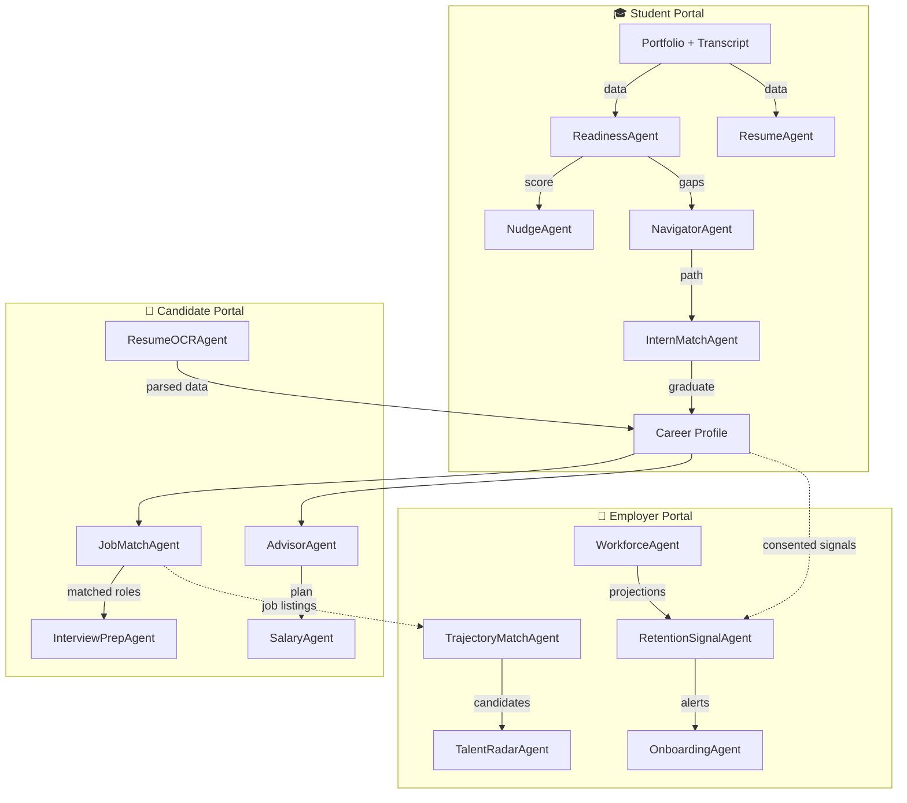
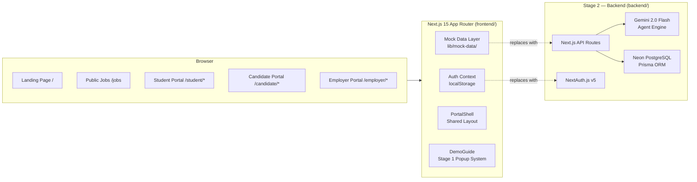
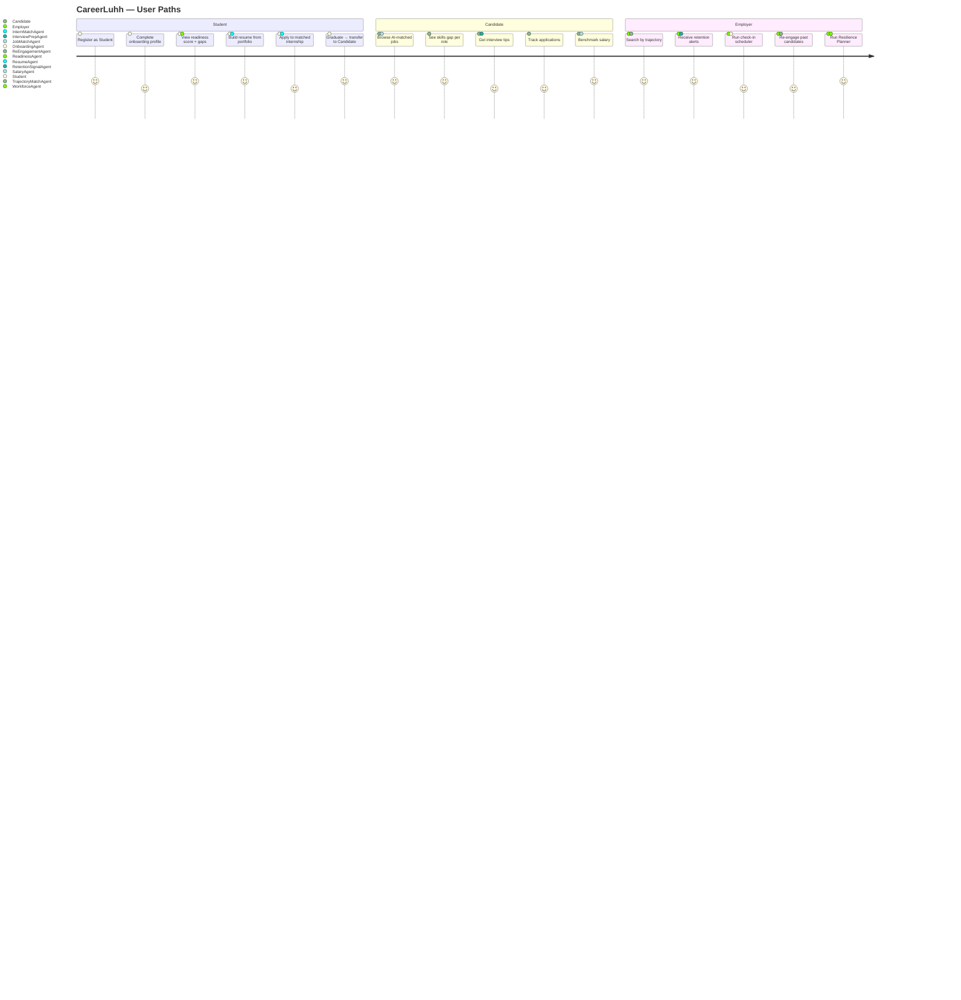

# CareerLuhh

> **"Career First, Everything Else Later"**
> Talentbank First Cohort Tech Hackathon 2026 · Stage 1 Prototype

---

CareerLuhh is Asia's Career Co-Pilot — a multi-agent AI platform that guides users from student life through active employment. Unlike job portals that match by keyword, CareerLuhh matches by **trajectory**: where you're heading, not just where you've been.

Not IT-only. CareerLuhh covers every industry — Technology, Finance, Healthcare, HR, Logistics, Education, and more. Any career. One platform.

**Live demo:** 3 portals, 1 living Career Profile, 20 jobs across 8 industries, 16 specialised AI agents.

---

## The Problem We Solve

Malaysian graduates and job seekers face three systemic failures:

1. **No map.** Career counselling is scarce, expensive, or generic. Students graduate without knowing what roles match their trajectory — only what keywords to paste into a CV.
2. **No signal.** Job boards rank listings by recency or sponsored placement. Candidates can't see their fit, their gap, or what to do about it.
3. **No co-pilot.** Employers hire reactively. By the time a resignation lands, the signal was visible weeks earlier — if anyone was looking.

CareerLuhh solves all three: a living career profile that connects students, active candidates, and employers through AI agents that explain their reasoning in plain language.

---

## The 16 AI Agents

| # | Agent | Code Name | Portal | Role |
|---|---|---|---|---|
| 1 | **The Auditor** | `ReadinessAgent` | Student | Scores career readiness 0–100 from portfolio, transcript, and skills |
| 2 | **The Navigator** | `NavigatorAgent` | Student | Maps 3 realistic career paths with year-by-year milestones |
| 3 | **The Recruiter** | `InternMatchAgent` | Student | Ranks internships by profile fit + absorption rate |
| 4 | **The Translator** | `SkorAlignAgent` | Student / Candidate | Translates Malaysian qualifications to global equivalents |
| 5 | **The Coach** | `NudgeAgent` | Student / Candidate | Urgency-aware advice tied to graduation date or job search timeline |
| 6 | **The Writer** | `ResumeAgent` | Student / Candidate | Drafts and reviews resume sections with AI tips per field |
| 7 | **The Analyst** | `ResumeOCRAgent` | Candidate | Parses uploaded resume, scores it 0–100, flags issues by severity |
| 8 | **JobMatchAgent** | `JobMatchAgent` | Candidate | Matches jobs by trajectory + skills gap, explains every decision |
| 9 | **The Advisor** | `AdvisorAgent` | Candidate | Builds a personalised 6-month next-move plan |
| 10 | **PayBenchmarkAgent** | `SalaryAgent` | Candidate | Benchmarks salary by role, level, city; generates negotiation script |
| 11 | **The Interrogator** | `InterviewPrepAgent` | Candidate | Company-specific interview tips based on role and hiring pattern |
| 12 | **The Headhunter** | `TrajectoryMatchAgent` | Employer | Finds candidates by growth curve — not just CV history |
| 13 | **The Scout** | `TalentRadarAgent` | Employer | Flags hidden-gem candidates weekly (TVET, self-taught, non-traditional) |
| 14 | **The Watcher** | `RetentionSignalAgent` | Employer | Surfaces flight risk from CareerLuhh-internal signals (post-consent) |
| 15 | **The Buddy** | `OnboardingAgent` | Employer | Schedules Day 30/60/90 manager check-ins with conversation scripts |
| 16 | **The Strategist** | `WorkforceAgent` | Employer | 5-year workforce projection + Resilience Planner calculator |

> **Stage 1:** All agent outputs are hardcoded mock data in `frontend/lib/mock-data/`.
> **Stage 2:** Live Gemini 2.0 Flash calls, Neon PostgreSQL, real-time signals.

---

## Agent Collaboration Flow



---

## System Architecture



---

## User Journey



---

## Key Features

### For Students
- **Readiness Score** — 0-100 career readiness with gap analysis (ReadinessAgent)
- **Career Roadmap** — 3 tailored paths with year-by-year milestones and honest Malaysian salary ranges
- **Internship Matcher** — ranked by fit AND absorption rate (not just allowance)
- **Resume Builder** — auto-populates from Portfolio + Transcript, A4 preview, PDF print, DOCX download
- **SkorAlign** — translates local credentials (UiTM Diploma, STPM, UTM degree) to global equivalents
- **Got a Job → Graduate** — one-click transfer of student profile to Candidate portal

### For Candidates
- **AI Job Matching** — jobs ranked by trajectory fit, not recency; every decision explained
- **Skills Gap per Role** — exact skills you're missing for each listing, not a vague score
- **Salary Benchmark** — market rate by role + city + level, with negotiation script
- **Resume OCR + Analyzer** — upload existing resume → score 0–100 → ranked issues
- **Application Tracker** — full pipeline view with AI feedback on rejections
- **Saved Jobs** — bookmark + full detail view with skills gap and interview tips

### For Employers
- **Trajectory Search** — finds candidates by growth curve; surfaces TVET and self-taught talent keyword filters miss
- **Candidate Profile** — expandable full profile: education, experience, skills, portfolio highlight
- **The Watcher** — platform-internal flight risk signals from consented staff activity (no LinkedIn scraping)
- **The Buddy** — Day 30/60/90 check-in scheduler with conversation scripts; mark done/skip
- **Workforce Resilience Planner** — interactive calculator: headcount + attrition + retirement → 5-year projection
- **Re-Engage** — warmlist of past candidates who've grown into current openings; editable draft + CareerLuhh chatbox

### For Everyone
- **Public Job Board** — browse 20 listings across 8 industries without logging in
- **PDPA 2010 Compliance** — consent on registration, privacy policy, robots.txt, data export and delete
- **Stage 1 Demo Guide** — floating "Page Guide" button on every page explains what's built (one config file, disabled for Stage 2)
- **Mobile-first** — fully responsive across all portals

---

## SDG Alignment

| SDG | Connection |
|---|---|
| **SDG 4 · Quality Education** | Career path guidance + skills gap analysis helps every Malaysian make better education and career decisions — not just those with access to good counsellors |
| **SDG 5 · Gender Equality** | Blind recruitment mode removes name, gender, photo, and university from screening — candidates evaluated on competency alone |
| **SDG 8 · Decent Work** | Salary benchmarking, gig-work credentialing, and a job board accessible without a top-5 university degree. TVET grads are first-class users |
| **SDG 10 · Reduced Inequalities** | Lokal Route compares net take-home in KL vs hometown. Rural youth aren't fooled by big city salary numbers |

---

## Tech Stack

| Layer | Technology |
|---|---|
| **Framework** | Next.js 15 · App Router · TypeScript strict mode |
| **Styling** | Tailwind CSS v4 · Custom Bauhaus design system |
| **Auth (Stage 1)** | Custom `useAuth` hook · localStorage session |
| **Auth (Stage 2)** | NextAuth.js v5 · email/password + OAuth |
| **Data (Stage 1)** | Hardcoded mock data in `lib/mock-data/*.ts` |
| **Data (Stage 2)** | Neon PostgreSQL · Prisma ORM |
| **AI (Stage 1)** | Mock agent outputs (JSON constants) |
| **AI (Stage 2)** | Google Gemini 2.0 Flash · structured outputs |
| **Deployment** | Vercel (zero-config Next.js) |
| **Security** | HSTS · CSP · X-Frame-Options · PDPA 2010 consent |

---

## Project Structure

```
CareerLuhh/
├── frontend/                        ← Next.js 15 app (Stage 1 prototype)
│   ├── app/
│   │   ├── page.tsx                 ← Landing page
│   │   ├── login/                   ← Auth pages
│   │   ├── register/
│   │   ├── jobs/                    ← Public job board (no login)
│   │   ├── privacy/                 ← PDPA privacy policy
│   │   ├── terms/                   ← Terms of service
│   │   ├── student/                 ← Student portal (11 pages)
│   │   │   ├── dashboard/
│   │   │   ├── roadmap/
│   │   │   ├── internships/
│   │   │   ├── portfolio/
│   │   │   ├── transcript/
│   │   │   ├── resume/              ← Resume builder + auto-populate
│   │   │   ├── qualifications/
│   │   │   ├── lokal/
│   │   │   ├── agents/              ← Agent Console
│   │   │   ├── graduate/            ← Portal transfer
│   │   │   └── settings/
│   │   ├── candidate/               ← Candidate portal (11 pages)
│   │   │   ├── dashboard/
│   │   │   ├── jobs/                ← AI-matched job board
│   │   │   ├── applications/
│   │   │   ├── saved/
│   │   │   ├── resume/              ← OCR + builder
│   │   │   ├── next-move/
│   │   │   ├── salary/
│   │   │   ├── portfolio/
│   │   │   ├── gig/
│   │   │   ├── agents/
│   │   │   └── settings/
│   │   └── employer/                ← Employer portal (9 pages)
│   │       ├── dashboard/
│   │       ├── search/              ← Trajectory-based talent search
│   │       ├── jobs/                ← Post & manage listings
│   │       ├── saved/
│   │       ├── re-engage/           ← Warmlist + chatbox
│   │       ├── onboarding/          ← Check-in scheduler
│   │       ├── workforce/           ← Watcher + Resilience Planner
│   │       ├── agents/
│   │       └── settings/
│   ├── components/
│   │   ├── agent-card/              ← Reusable AgentCard component
│   │   ├── bauhaus/                 ← Logo, geometric elements
│   │   ├── shared/
│   │   │   ├── PortalShell.tsx      ← Sidebar + topbar layout
│   │   │   ├── DemoGuide.tsx        ← Stage 1 page guide popup
│   │   │   ├── SettingsContent.tsx  ← Profile edit + delete account
│   │   │   └── CoachAlert.tsx
│   │   └── roadmap-tree/
│   ├── lib/
│   │   ├── auth-context.tsx         ← Auth + updateProfile + deleteAccount
│   │   ├── demo-guide.ts            ← Stage 1 page guide config (all pages)
│   │   └── mock-data/
│   │       ├── jobs.ts              ← 20 jobs across 8 industries
│   │       ├── student.ts           ← Student profile + portfolio + transcript
│   │       └── employer.ts          ← Candidates + retention signals + new hires
│   └── public/
│       └── robots.txt               ← PDPA-aligned crawler rules
│
└── backend/                         ← Stage 2 blueprint
    ├── prisma/schema.prisma         ← DB schema (User, Job, Application, Agent)
    └── agents/                      ← Agent spec + Gemini prompt templates
```

---

## Hackathon Criteria Alignment

| Criterion | Weight | How We Address It |
|---|---|---|
| **Product & UX Thinking** | 30% | 3 distinct user archetypes, clear problem statement, agents explain their reasoning in plain language, honest AI (not hype) |
| **System Design & Integration** | 25% | 3 portals sharing one Career Profile, 16 agents with defined inputs/outputs, clean module boundaries, Stage 2 architecture pre-defined |
| **Completeness** | 20% | 31 live routes, end-to-end user journey per portal, mobile-responsive, deployed to Vercel |
| **AI Craft** | 15% | Gemini 2.0 Flash selected for structured outputs + low latency; prompt design documented in `/backend/agents/`; Stage 1 mock outputs mirror real agent schema |
| **Code Quality** | 10% | TypeScript strict mode, zero `any`, PDPA security headers, no plaintext credentials in client bundle |

---

## Run Locally

```bash
cd frontend
npm install
npm run dev      # → http://localhost:3000
```

## Deploy to Vercel

1. Push this repo to GitHub
2. Vercel → **Add New Project** → import the repo
3. **Set "Root Directory" to `frontend`** ← the only required setting
4. Framework auto-detects Next.js → Deploy

No environment variables needed for Stage 1.

## Demo Accounts (password: `demo123`)

| Role | Email | Portal |
|---|---|---|
| Student | `student@demo.com` | `/student/dashboard` |
| Candidate | `candidate@demo.com` | `/candidate/dashboard` |
| Employer | `employer@demo.com` | `/employer/dashboard` |

Or use the one-click demo buttons on `/login`.

---

## License

MIT — built for the Talentbank First Cohort Tech Hackathon 2026.

---

## Team

**Syaqirah** — Software Developer

*CareerLuhh · Career First, Everything Else Later*
